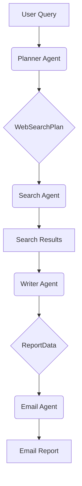
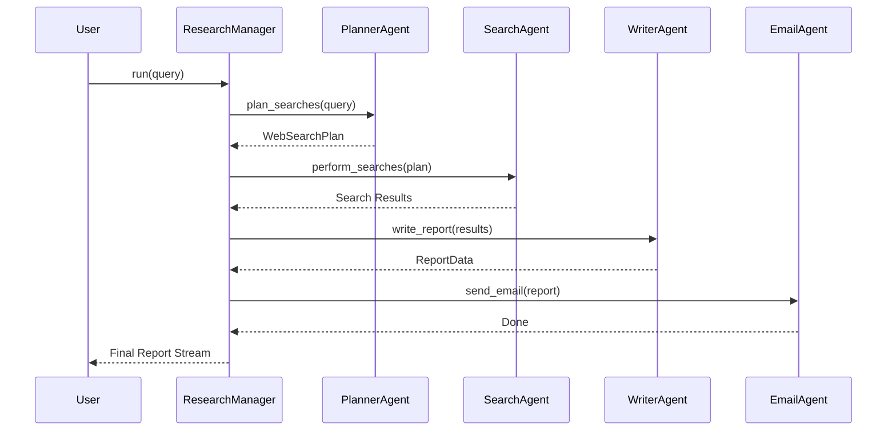

# Deep Research Agent

This project implements a multi-agent system for conducting in-depth research on a given topic. The system uses a team of AI agents, each with a specialized role, to plan and execute research, synthesize the findings into a comprehensive report, and email the result.

## Features

-   **Autonomous Research:** Given a query, the agent system autonomously plans and executes web searches.
-   **Multi-Agent System:** Utilizes a team of specialized agents (Planner, Searcher, Writer) for a modular and robust workflow.
-   **Structured Output:** Leverages Pydantic for structured data validation and to ensure reliable communication between agents.
-   **Email Integration:** Seamlessly sends the final report via email using SendGrid.
-   **Web Interface:** A simple Gradio-based UI for easy interaction.
-   **Tracing:** Integrated with OpenAI's tracing to monitor and debug agent interactions.

## How it Works

The Deep Research Agent is composed of four main agents that work in sequence:

1.  **Planner Agent:** Receives the initial research query and creates a structured search plan.
2.  **Search Agent:** Executes the search plan by performing web searches for each item in the plan.
3.  **Writer Agent:** Synthesizes the information gathered by the Search Agent into a detailed report.
4.  **Email Agent:** Takes the final report and emails it to a specified recipient.

The entire process is orchestrated by the `ResearchManager`.

### Architecture Diagram


### Agent Communication
The `ResearchManager` acts as a central orchestrator, passing messages between the different agents. Each agent completes its task and returns the result to the manager, which then passes it to the next agent in the pipeline.



## Usage

1.  **Install dependencies:**
    ```bash
    pip install -r requirements.txt
    ```
    *(Note: You'll need to create a `requirements.txt` file with `openai`, `gradio`, `pydantic`, `python-dotenv`, and `sendgrid`)*

2.  **Set up your environment variables:**
    Create a `.env` file in the root of the `2_openai` directory and add your API keys:
    ```
    OPENAI_API_KEY="sk-..."
    SENDGRID_API_KEY="..."
    ```

3.  **Run the application:**
    ```bash
    python deep_research.py
    ```
    This will launch a Gradio interface in your browser.

## Project Structure
- `deep_research.py`: The main entry point with the Gradio web interface.
- `research_manager.py`: Orchestrates the entire research process.
- `planner_agent.py`: Defines the agent responsible for planning the research.
- `search_agent.py`: Defines the agent responsible for executing web searches.
- `writer_agent.py`: Defines the agent responsible for writing the final report.
- `email_agent.py`: Defines the agent responsible for sending the email. 